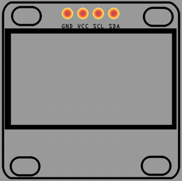
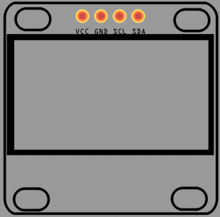
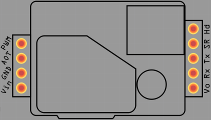

# esp8266-fritzing-parts

This repository contains parts based on the ESP8266 for the Fritzing application. Just download the .fzpz file and drag it into fritzing

Where applicable, both the breadboard and the silkscreen are designed.

## Available parts
### [NodeMCU V1.0](https://github.com/squix78/esp8266-fritzing-parts/blob/master/nodemcu-v1.0/NodeMCUV1.0.fzpz): this is the second incarnation of the ESP8266 based dev board. You can find it on [AliExpress]( http://s.click.aliexpress.com/e/QbUnuvrVV) 

Read more about it [on my blog](http://blog.squix.ch/2015/05/esp8266-nodemcu-v10-part-created-for.html).

### OLED SSD1306 0.96" 128x64 displays
There are two versions of these displays, with only the GND and VCC swapped.

 

  

### OLED SSD1306 0.91" 128x32 display
The 0.91" displays are quite small and only show 32 pixels height.
Default they show only every other line, so they remain compatible with the existing libraries.

### OLED SSH1106 1.3" 128x64 display
The larger 1.3" OLED monochrome displays use the SSH1106 chip.

 

### MH-Z19 CO2 sensor
The [MH-Z19](http://www.winsen-sensor.com/products/ndir-co2-sensor/mh-z19.html) and the [MH-Z19B](http://www.winsen-sensor.com/products/ndir-co2-sensor/mh-z19b.html) are quite affordable CO2 sensors.
These are pin-out compatible (not software compatible) with the [Senseair S8 CO2 sensor](http://www.senseair.com/products/oem-modules/senseair-s8/) The S8 has its air intake at the bottom. For this purpose the air intake opening of the S8 sensor is also drawn in the silk screen to make it easier to add an opening in the PCB.

 
